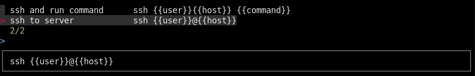
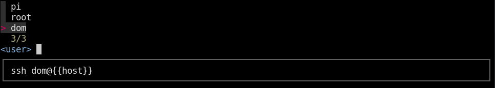
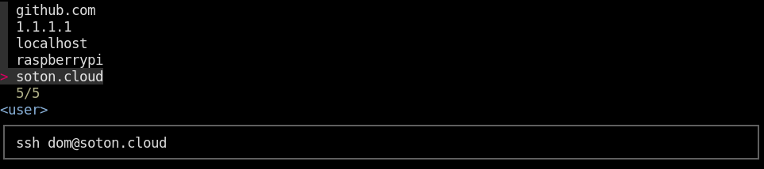

# Specification

## Goal

The goal is to provide a fast interface for using code snippets.

### Example

When in the terminal, the user presses `CTRL+G`. This opens the FZF UI that looks somewhat like this:



The user can search and select one of these command snippets. Once selected, press enter. This will prompt you to input the values one by one:




When you press enter on the last input the command will appear in your terminal. If you want to run it, press enter again.

Notice that some of the values are just examples, while some are obtained from the system (like `dom` since it knows that user exists on this system) and some are cached from previous entries (like `soton.cloud` that has been used as `host` before).


### Case study #1

#### Snippets 
Let's say you want to write a simple snippet that allows you to ssh into a remote host.

```
# connect to remote computer
`ssh <user>@<host>`
```

This will be interpreted to this:
```
Snippet(
  description: "connect to remote host",
  values: [
    SnippetValue([
      Text("ssh "),
      Reference("user"),
      Text("@"),
      Reference("host")
    ])
  ],
)
```

#### Sets

The references must point to a defined `Set`. These can be defined inside of files and must be *globally unique*.

Here is how you would go about defining set `user`:

```
user = { "root", `grep wheel /etc/group | cut -d':' -f4` }
```

Which will be converted to something like this:

```
Set(
  identifier: "user",
  values: [
    SetValue::Text("root"),
    SetValue::Code("grep wheel /etc/group | cut -d':' -f4")
  ]
)
```

> But what if the `SetValue` contains a reference to another set?

Currently that's not possible, but if you can think of use cases in which that's a useful feature feel free to create an issue.

Any values enclosed in backticks will be executed to obtain real values that work on the given machine. In this case, I get the following results:

```
dom
guest
```

As you can see, the backticks can return more than one value, which is why you should think of backticks as also being an implicit spread operator, since the set will result in `{root,dom,guest}` rather than `{root,{dom,guest>`.

#### Environment-Specific commands

But it can't be as simple as that. Running commands introduces another problem. What if the command isn't available in a different environment? If we want this query language to work cross-platform it will need to be able to run distinct commands depending on the environment.

For example to shutdown your device you'll need to use different commands:

 * Mac: `shutdown -h now`
 * Linux: `poweroff`

This is where Decorators come in. The allow you to filter out which commands can be executed.

```
# turn off the computer
@os("mac") `shutdown -h now`
@os("linux") `poweroff`
```

Here is a list of valid decorators:

 - `@os(a,b,...,z)` - checks if **any** of the parameters contains the name of the current os.
 - `@bin(a,b,...z)` - checks if **all** binaries exist.

Decorators can take as many values as you want (e.g. `os("mac","linux")`) and can also be combined together (e.g. `@os("linux") @bin("systemctl")`). The snippet will execute **all** commands that the decorator matches, **not just the first** one.

This slightly changes the structure of our AST:

```
Snippet(
  description: "connect to remote host",
  values: [
    SnippetValue(
      decorators: [
        ValueDecorator(name: "os", values: ["mac", "linux"])
      ],
      children: [
        Text("ssh "),
        Reference("user"),
        Text("@"),
        Reference("host")
      ]
    )
  ],
)
```

> Can you reference another snippet?

No. Currently this is not supported.

#### Pretty options (RFC, not yet finalized)

We're not done yet. Consider connecting to wifi as an example:

```
# connect to wifi
@bin("nmcli") `nmcli dev wifi connect <ssid> password <password>`
```

Let's skip the password declaration (for now, it will be discussed later) and move straight to `ssid`:

```
ssid = { `sudo nmcli dev wifi list` }
```

> TODO: implement the design, reconsider if there's a better way than @return-pipe(`xargs | cut -d' ' -f2`)

> This requires everything else up until this point to be implemented, since running pipes on existing commands might be tricky without parsing it somehow.

#### Caching (most used value first, custom values)

Although you define all of your sets, the values in them might not always conver everything you need.

For example, there's no way of knowing what usernames are valid for an ssh remote host. You can guess by listing the users on the current machine, maybe add common other usernames like "root" or "pi".

And that's good enough, because it will give the user an idea of example values, which is enough for them to input their value. When they enter a manual value, it will get cached and displayed next time. Caching also allows the most used values to appear first, so the user just has to press enter instead of having to input a part of it to fuzzy search or navigate with the arrow keys.

> TODO: cache file structure

#### Disabling cache

Although caching sounds great, sometimes it's a bad idea. The cache file is a non-encrypted plaintext file, and we don't want to store sensitive data in there such as passwords.

For passwords, you shouldn't use a set in the first place. Use something like this:

```bash
grep $(read -p "Password: "; echo $REPLY) .*
```

But if the values actually don't need to be cached (like in the following example) you can use `@forget` decorator on the set itself:

```
@forget pid = { `ps -A | sed 's/^ *//g' | cut -d' ' -f1` }

# kill process
`kill <pid>`
```

#### Strict mode

Just like the `@forget` decorator, the `@strict` decorator can be used on a set. Strict means that no custom/manual values can be inputted, however caching is still enabled to show you the most commonly used values. 

#### Subsets

Consider IP addresses. You could define all valid IP addresses in in a single set. Wouldn't it be much better to split them into two sets?

```
ip_v4 = { "127.0.0.1", "1.1.1.1", `get my local ip`, public_ip_v4, local_ip_v4 }
ip_v6 = { "::1", public_ip_v6 }
ip = {ip_v4, ip_v6}
```

So we just need to add `SubsetOf` to the `SetValue` enum.

#### Same type used multiple times in 1 snippet

TODO: give `ssh -J` example
TODO: explain why it's not possible and how to bypass that